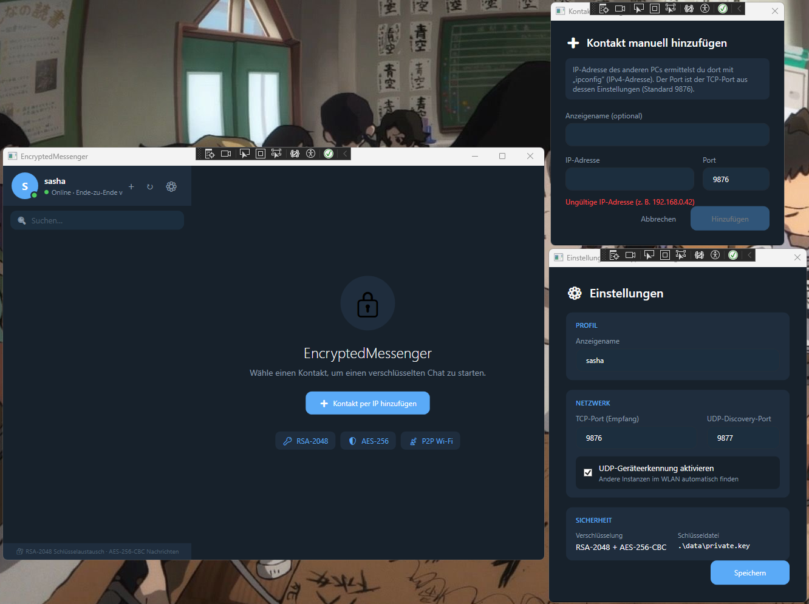

# EncryptedMessenger



A serverless, end-to-end encrypted peer-to-peer messenger for the local network (LAN), built with C# and .NET 8. Two or more instances discover each other automatically and exchange text messages directly — no central server, no internet round-trip.

## Features

- **Serverless P2P messaging** over TCP between instances on the same LAN.
- **End-to-end encryption** using a hybrid scheme: RSA-2048 for the key exchange, AES-256 for message contents.
- **Contact requests with consent:** peers found via UDP broadcast appear under "Kontakte finden" (📡), not directly in your contacts. You send a request, the other side accepts or declines, and only accepted contacts can message you. Messages from anyone else are refused without being stored. Contacts can also be requested by IP address and port. Requests made while the peer is offline are delivered when it comes online.
- **Persistent history** — contacts and messages stored locally with Entity Framework Core + SQLite.
- **Background Windows Service** that keeps receiving messages even when the UI is closed (optional; the app also runs standalone).
- **WPF desktop UI** built with the MVVM pattern (contacts list, chat view with emojis, settings).
- **Delivery / read receipts** (✓ sent, ✓✓ delivered, blue ✓✓ read, ✗ failed) and online/offline status.

## Architecture

The solution is split into three projects:

| Project | Type | Responsibility |
|---|---|---|
| `EncryptedMessenger.Core` | Class library | Crypto, networking, IPC, database, models — the shared logic |
| `EncryptedMessenger.WindowsService` | Worker Service | Runs the network stack as a background Windows service |
| `EncryptedMessenger.WPF` | WPF app | Graphical user interface (startup project) |

The UI and the service communicate over a **named pipe** (JSON messages). If no service is running, the WPF app starts the core logic in-process automatically (standalone mode).

```
  WPF UI  <-- named pipe (JSON) -->  Windows Service (Worker)
                                            |
                                    EncryptedMessenger.Core
                                     |                    |
                              TCP (messages)     UDP (peer discovery)
                                     v                    v
                          other instances on the local network
```

## Security model

- Each instance generates an **RSA-2048** key pair on first run; the private key is **DPAPI-protected** on disk (only readable by that Windows account on that machine) and never leaves it.
- For every TCP connection a random **AES-256** key is generated, encrypted with the peer's public RSA key (**RSA-OAEP with SHA-256**) and sent over. Each connection keeps its own key, and incoming messages are attributed to the identity from that connection's handshake, not to a sender ID claimed inside a packet.
- Messages are encrypted with **AES-256-GCM** (authenticated encryption) using that session key, with a fresh random nonce per message — tampering with a message in transit causes decryption to fail rather than silently returning corrupted data.
- Local chat history is separately encrypted at rest with a persistent per-install AES-256-GCM key, independent of the per-session keys.
- **Key pinning (trust on first use, like SSH):** the first public key seen for a contact is pinned. On every later handshake, in both directions, a different key makes the app **refuse the connection before any session key is exchanged**. Redirecting a contact (a spoofed discovery packet, ARP spoofing, a wrong manual IP) therefore can't expose messages, only block the connection.
- The chat header shows the **SHA-256 fingerprint** of the peer's key. When a contact's key changes, a red banner shows the new fingerprint and sending is disabled. Only after comparing it out-of-band (phone, in person) should the user click "Neuen Schlüssel akzeptieren", for example after a legitimate reinstall. The app accepts exactly the key with the fingerprint that was displayed.
- **40-digit verification code** (8 groups of 5, Signal-style "safety number"): 20 digits derived from each public key, in sorted order, so both sides see the same code unless someone is in between. It is shown on contact requests and in the chat header ("Code prüfen"). After comparing it by phone or in person, the contact is marked "✓ Überprüft". To pass the comparison, an attacker would need a key matching the 20 digits of the victim's existing key (~10²⁰ attempts). Accepting a changed key resets the mark.
- The UI↔service named pipe is restricted to the current Windows user.

> **Note:** This is a study project. The very first connection to a contact is trusted automatically (TOFU). An attacker who intercepts that first connection, and every one after it, stays undetected unless the users compare the verification code. As soon as the real peer connects directly, the key mismatch blocks and flags it. UDP discovery announcements themselves are not authenticated, so a spoofed one can still rename a contact or make a connection attempt fail. It is intended for confidential messaging inside a trusted local network.

## Tech stack

- **.NET 8** (`net8.0-windows`), **C#**
- **WPF** + **MVVM**
- **Entity Framework Core 8** with **SQLite**
- **Named Pipes** for inter-process communication
- **Worker Service** hosting (`Microsoft.Extensions.Hosting.WindowsServices`)
- **System.Text.Json** for serialization
- Fully **async/await** networking

## Getting started

### Prerequisites

- Windows
- [.NET 8 SDK](https://dotnet.microsoft.com/download) (or the .NET 8 Desktop Runtime to run only)
- Visual Studio 2022 (recommended)

### Build & run

```bash
git clone https://github.com/sashabilenko9-glitch/EncryptedMessenger.git
cd EncryptedMessenger
dotnet build EncryptedMessenger.slnx
dotnet run --project EncryptedMessenger.WPF
```

Or open `EncryptedMessenger.slnx` in Visual Studio and run the **EncryptedMessenger.WPF** project.

To test messaging, run one instance on each of two PCs (or a PC and a VM) on the same network. Two instances on the *same* machine don't work as separate peers: the UI↔service named pipe has a fixed name, so a second launch attaches as another UI to the first instance's service instead of starting its own.

### Publish a standalone .exe

```bash
dotnet publish EncryptedMessenger.WPF -c Release
```

Produces a single self-contained `EncryptedMessenger.exe` (in `EncryptedMessenger.WPF/bin/Release/net8.0-windows/win-x64/publish/`) that runs on any Windows 10/11 machine with **no .NET install required** — copy it to a USB drive or share it directly.

### Optional: install the background service

```bash
dotnet publish EncryptedMessenger.WindowsService -c Release
sc create EncryptedMessenger binPath= "C:\path\EncryptedMessenger.Service.exe" obj= ".\YourWindowsUser" password= "..."
sc start EncryptedMessenger
```

Run the service under **your own Windows account** (`obj=`), not the default LocalSystem: the keys are DPAPI-protected per Windows user, so a service running as a different account cannot read keys created by the app (it fails with an explicit error and leaves the key files untouched).

## Configuration & data

All data lives in a `data/` folder **next to the executable** (the app and the service set their working directory to the exe folder at startup, so it doesn't matter where they're launched from). On first run the app creates:

- `data/settings.json` — your persistent user ID, display name, TCP/UDP ports, discovery toggle (a corrupt file is kept as `settings.json.corrupt` and replaced with defaults)
- `data/messenger.db` — the SQLite database (auto-created via EF Core)
- `data/private.key` — the RSA private key (DPAPI-protected)
- `data/storage.key` — the at-rest history key (DPAPI-protected)
- `data/logs/` — daily rolling log files

The user ID in `settings.json` is your identity towards peers — keep the file (and the keys) when moving or updating the app.

No installation or database server is required — external libraries are restored automatically from NuGet.

## Project structure

```
EncryptedMessenger/
├─ EncryptedMessenger.slnx
├─ EncryptedMessenger.Core/
│  ├─ Encryption/      # RsaCryptoService, AesCryptoService, CryptoManager
│  ├─ Network/         # MessengerServer, MessengerClient, PacketHelper, PeerDiscovery
│  ├─ IPC/             # PipeServer, PipeClient, PipeMessage
│  ├─ Database/        # AppDbContext, ContactRepository, MessageRepository
│  ├─ Models/          # Contact, Message, AppSettings, NetworkPacket
│  └─ Services/        # MessengerService (orchestrator)
├─ EncryptedMessenger.WindowsService/   # Program, MessengerWorker
└─ EncryptedMessenger.WPF/              # App, Views, ViewModels, Converters, Helpers
```

## License

This project is licensed under the MIT License — see the [LICENSE](LICENSE) file for details.
